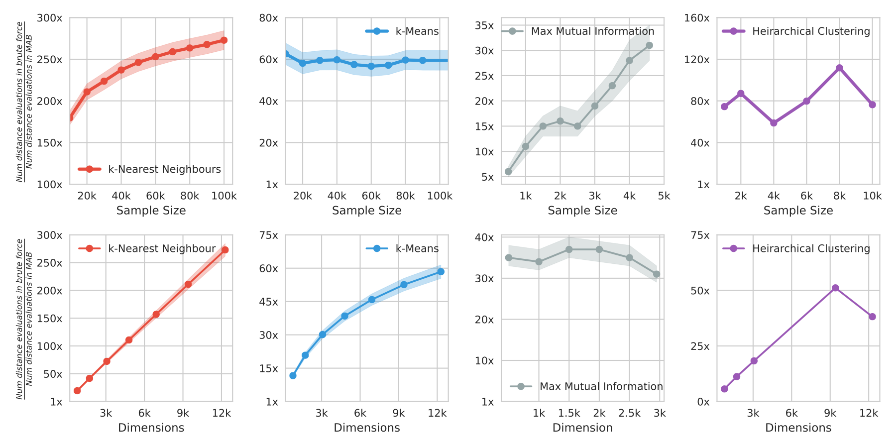
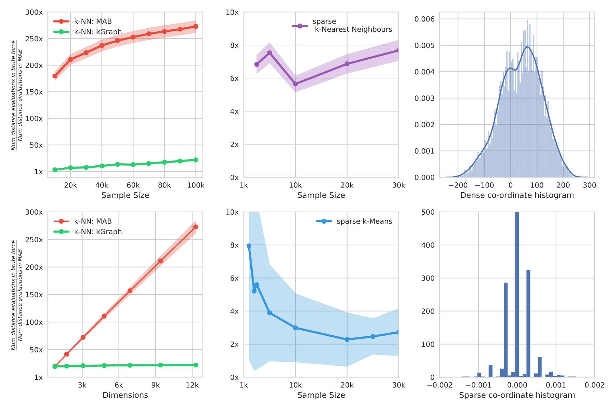
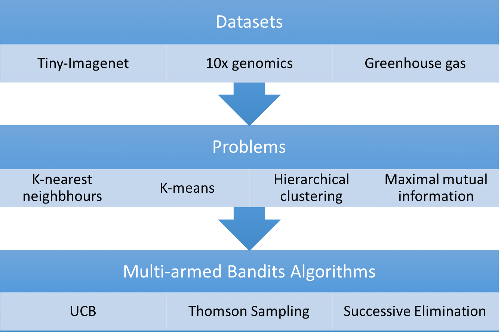

## Notes
- If distance between datapoints heavily depends on a few co-oridinates then 'smooth' the data using [Fast John-LindenStrauss transform](https://www.cs.princeton.edu/~chazelle/pubs/FJLT-sicomp09.pdf) before using the software.
- Dependendices : g++-4.9, gcc-4.9,  cmake,  libboost-all-dev,  build-essential,  libhdf5-serial-dev.
- Run `./utils/build.sh` to build all the binaries.
- `aws_server.ini` stores all the information (such as datapath, saveResultsPath) required by the  software.

## Reproducibility
- All the figures can be generated in ipython notebooks in 'figure' folder.
- The figures are generated from experiments - stored in 'experiments' folder.
- The stored experiments for dense datasets can be reproduced using the following lines of code
  - K-nearest neigbhours : `./build/knn aws_server.ini start-index end-index` (finds the k nearest points for points from start to end index)
  - K-means : `./build/kmeans aws_server.ini`
  - Heirarchical: `./build/heirarchical aws_server.ini random-seed`
  - Mutual Information Feature Selection: `./build/gasmmi aws_server.ini number-features sample-size random-seed`
- The stored experiments for sparse datasets can be reproduced using the following lines of code
  - K-nearest neigbhours : `./build/knn10x aws_server.ini start-index end-index` (finds the k nearest points for points from start to end index)
  - K-means : `./build/kmeans10x aws_server.ini`

## Empirical results on Imagenet (Main results)

## Empirical results on sparse datasets

## Datasets
- [Tiny-imagenet](https://tiny-imagenet.herokuapp.com/)
- [10x Genomics](https://support.10xgenomics.com/single-cell-gene-expression/datasets/1.3.0/1M_neurons)
- [Gas sensors](https://archive.ics.uci.edu/ml/datasets/gas+sensor+array+drift+dataset)

## Software Architecture

